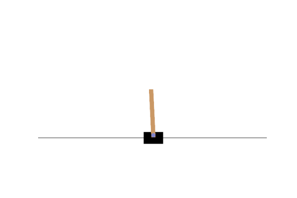

# genepro
<figure>

<figcaption>
<i>Art of a juniper, "ginepro" in Italian, made with the</i> <a href="https://github.com/anopara/genetic-drawing">genetic drawing repo</a> <i>by</i> <a href="https://github.com/anopara">@anopara</a>.
</figcaption>
</figure>

[](https://zenodo.org/badge/latestdoi/463139106)

## In brief

`genepro` is a Python library providing a baseline implementation of genetic programming, an evolutionary algorithm specialized to evolve programs.
This library includes a classifier and regressor that are compatible with scitik-learn (see **examples of usage** below).

Evolving programs are represented as trees.
The leaf nodes (also called *terminals*) of such trees represent some form of input, e.g., a feature for classification or regression, or a type of environmental observation for reinforcement learning.
The internal ndoes represent possible atomic instructions, e.g., summation, subtraction, multiplication, division, but also if-then-else or similar programming constructs.

Genetic programming operates on a population of trees, typically initialized at random. 
Every iteration (called *generation*), promising trees undergo random modifications (e.g., forms of *crossover*, *mutation*, and *tuning*) that result in a population of offspring trees.
This new population is then used for the next generation.


## Installation
To run, `genepro` relies only on a few libraries to run (`numpy`, `joblib`, and `scikit-learn`).
However, additional libraries (e.g., `gym`) are required to run some examples.
You can choose to perform a minimal or full installation.

### Minimal installation
To perform a minimal installation, run:
```
pip install genepro
```

### Full installation 
For a full installation, clone this repo locally, and make use of the file [requirements.txt](requirements.txt), as follows:
```
git clone https://github.com/marcovirgolin/genepro
cd genepro
pip install -r requirements.txt .
```

### Wish to use conda?
A conda virtual enviroment can easily be set up with:
```
git clone https://github.com/marcovirgolin/genepro
cd genepro
conda env create
conda activate genepro
pip install .
```


## Examples of usage

### Classification and regression
The notebook [classification and regression.ipynb](<classification and regression.ipynb>) shows how to use `genepro` for classification and regression, via scikit-learn estimators.

These estimators are intended for data sets with a small number of (relevant) features, as the evolved program can be written as a compact (and potentially **interpretable**) symbolic expression.


```
...
gen: 38,	best of gen fitness: -3010.345,	best of gen size: 43
gen: 39,	best of gen fitness: -2998.565,	best of gen size: 43
gen: 40,	best of gen fitness: -2986.394,	best of gen size: 45
The negative mean squared error on the test set is -2757.157 (respective R^2 score is 0.546)
Obtained by the (simplified) model: 
5*x2 + 3*x3 - x6 + 3*x8 + log(abs(x9)) + log(abs(2*x2 + x8 + 1.44)) - 9.266
```
*Example of output of a symbolic regression model discovered for the [Diabetes data set](https://scikit-learn.org/stable/modules/generated/sklearn.datasets.load_diabetes.html)*.

### Reinforcement learning
The notebook [gym.ipynb](gym.ipynb) shows how `genepro` can be used to evolve a controller for the *CartPole-v1* environment of the OpenAI [gym](https://github.com/openai/gym) library.

<figure>

<figcaption>
<i>Behavior of the evolved cart pole (symbolic) controller: 

(x2 + x3)*(x2*x3 + x3 + x4 + 1)*log(abs(x2))**2*log(abs(x3))**2</i>
</figcaption>
</figure>


## Citation
If you use this software, please cite it with:
```
@software{Virgolin_genepro_2022,
  author = {Virgolin, Marco},
  doi = {10.5281/zenodo.6258591},
  month = {2},
  title = {{genepro}},
  url = {https://github.com/marcovirgolin/genepro},
  version = {0.0.1},
  year = {2022}
}
```
